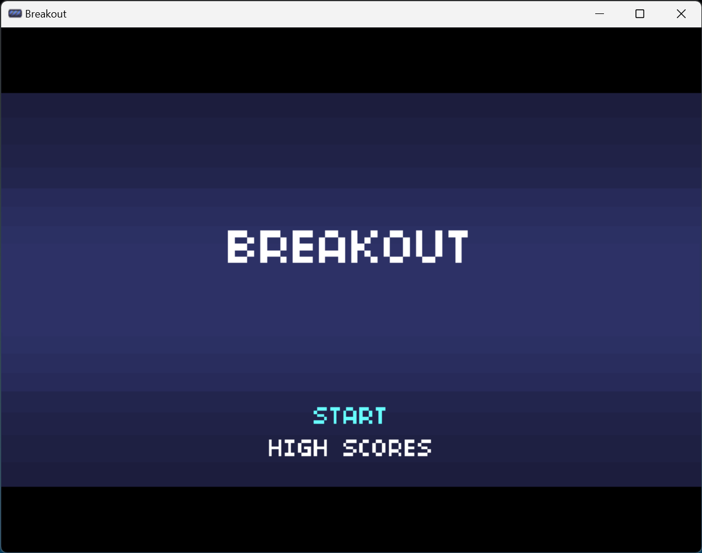
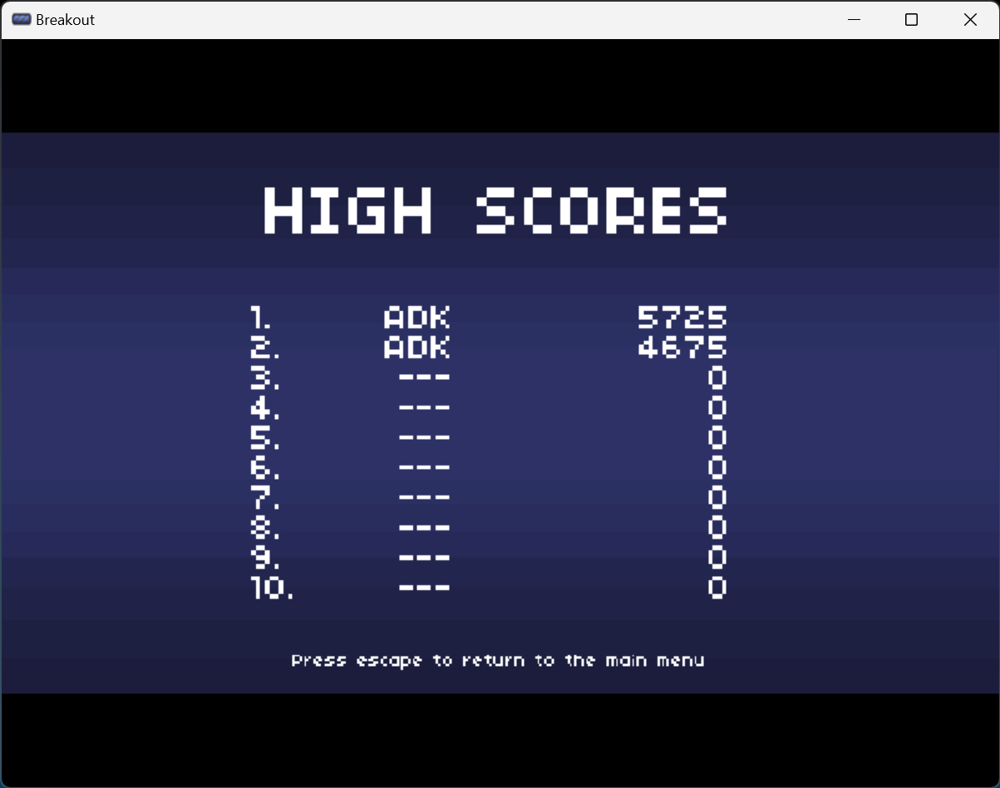
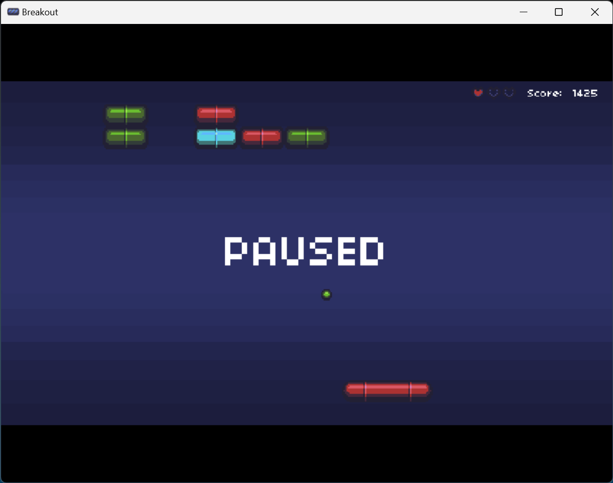
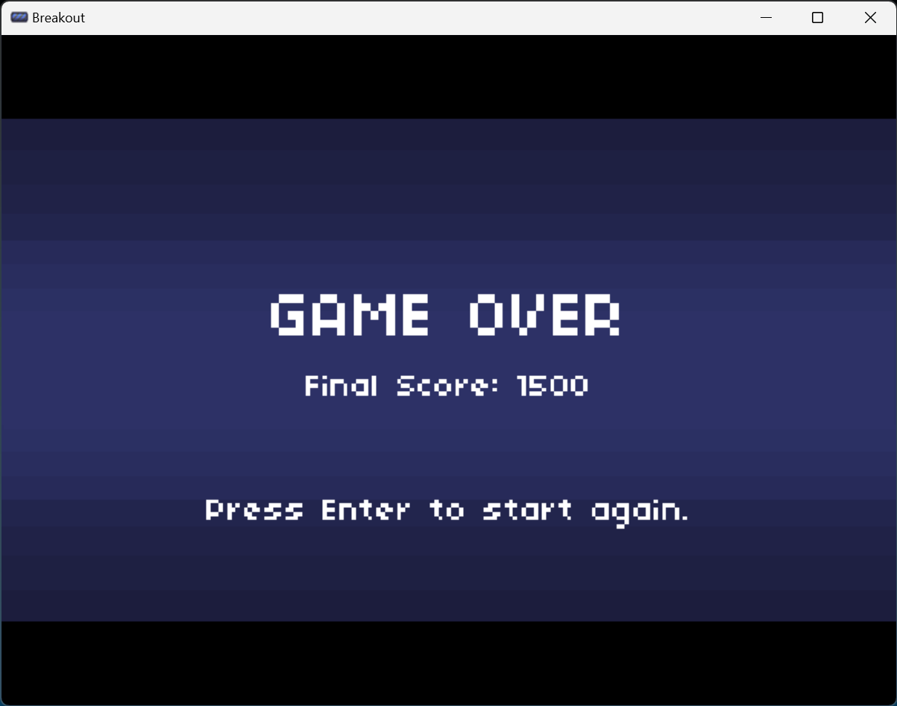

## Installation
Windows users can use the [Releases](https://github.com/karthikeya-aduri/breakout-clone/releases/) page for installation.

Linux and MacOS users require Love2D (version 11.5) and use the [Releases](https://github.com/karthikeya-aduri/breakout-clone/releases/) page and download the .love file.

Run the .love file using Love2D. Install the framework from here: [Love2D](https://love2d.org/)

## Music
The theme music was created by [Seth_Makes_Sounds](https://freesound.org/people/Seth_Makes_Sounds/)

## Controls
- Space for pause
- Left and Right arrow keys for moving the paddle
- Escape to quit the game

## Screenshots

